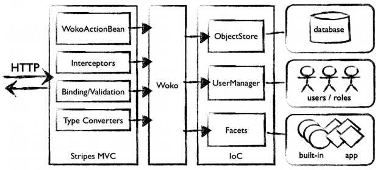
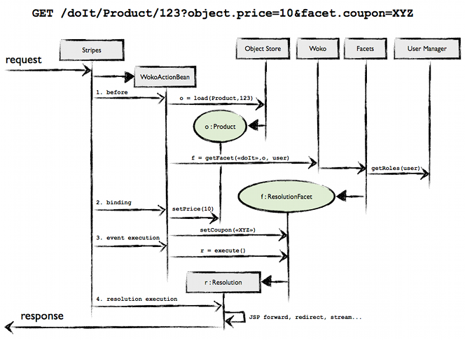
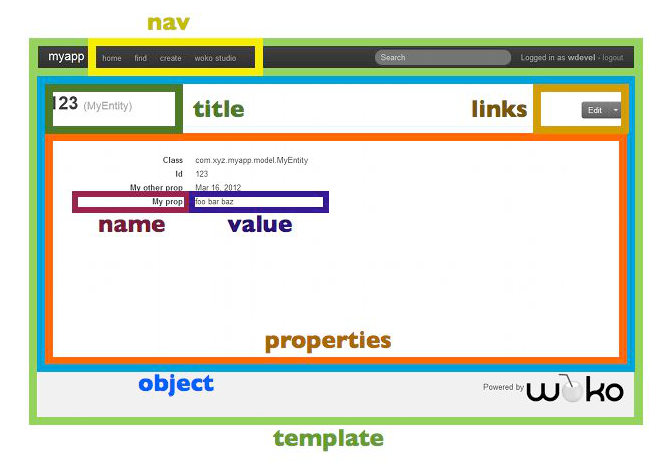

Title:  Woko: Developer Guide
{{top-nav.html}}

<div class="page-header">
    <h1>
        Developer Guide
        <small>Everything about Woko!</small>
    </h1>
</div>


This document describes the architecture and internals of Woko.
It explains every relevant module, and shows how to use/extend the Woko APIs.

You should be familiar with Java, MVC Frameworks and Web technologies in general before you read this.
Woko is full stack, and relies on many different technologies. Some are optional (pluggable), but
the foundation itself involves various concepts, APIs and protocols.

# Architecture

Woko itself doesn't do much. It's nothing but a good mix of various technologies combined altogether. The core runtime has very few dependencies : [Stripes](http://www.stripesframework.org) and [JFacets](http://jfacets.rvkb.com) only. Then, pluggable components provide the necessary services, like persistence or user management.

The overall architecture looks like this :

<center>

</center>

## Domain Objects 

Domain Objects in Woko are POJOs. We don't use no meta-framework of any kind, only the Java type system. 

Woko manages your POJOs through the `ObjectStore`, which handles the persistence of your objects.
The store is created at startup and connects to an underlying database in order to save the state and provide access to your Objects. This can be implemented in many different ways, using an ORM, custom DAOs, or whatever you can think of.

> The ObjectStore only implements the basic CRUD operations by default, but it's a good entry point to place more specialized accessors to your domain objects (e.g. queries) when you'll need them. Like other Woko components, it is accessible everywhere in your application. 

Woko heavily uses introspection (`java.lang.reflect`) in order to determine the properties to display etc. In general, your Domain Objects should be regular POJOs that follow the JavaBean convention. Woko's ObjectRenderer will work directly with objects that :

* have a default constructor (if you want to be able to create instances via the default generated interface)
* expose their properties with accessors following the JavaBean convention
* use generics for Collections and Maps (e.g. `List<MyClass>`) so that Woko knows the compound types

> Woko ships with a fully functional Hibernate-backed ObjectStore that uses automatic classpath scanning, JPA annotations for the mapping, and `javax.validation` annotations for validation constraints. It can be used as-is and extended if needed.


## MVC Layer

The MVC layer is built on top of the fantastic [Stripes](http://www.stripesframework.org) framework, _because it doesn't have to suck_. 
It's one of the few libs that Woko exposes directly, and that you will have to use when developing a Woko application.
	
Woko uses a main `ActionBean` for serving all the requests (excepted for static resources of course), along with several Stripes extensions that make binding, validation etc. work directly your Domain Objects and users.  

### WokoActionBean

It's the main Controller for the Woko app. Kind-of a "super dispatcher" that handles all requests and delegates to the appropriate facet. 

Unlike a typical Stripes app, a typical Woko application doesn't use several `ActionBean`s. They are replaced by Woko's controllers : `ResolutionFacet`s. WokoActionBean handles the http request, and delegates to a ResolutionFacet, which does the actual processing and return a Stripes `Resolution`.   

`WokoActionBean` defines Woko's URL scheme. It responds to all requests with a path like : 

    /facetName}[/className[/key]]

Here below are typical Woko URLs that WokoActionBean will handle by delegating to the appropriate components :

* `/view/Product/123`
* `/?facetName=view&className=product&key=123` (with regular parameters)
* `/list/Product`
* `/home`
* `/doSomeFunkyStuff/MyClass/123?facet.foo=123&object.bar=cool`

The URL scheme is a very important part of Woko. The URL for a page usually shows the intent through the facet name, and target object. URLs like `/view/Product/cool-sneakers` or `/edit/StockEntry/1234` often contain meaningful information. Woko kind of standardizes that through its consistent URL scheme. 

The different parts of the URL (`facetName`, `className` and `key`) are used by WokoActionBean in order to resolve the target object and Resolution Facet to be applied.

All other parameters are prefixed with either `facet.` or `object.` : they will be bound respectively to the Resolution Facet and target Object, provided they satisfy the validation constraints if any. Resolution Facets are explained in detail [here](#resolutionfacets").

> NOTE : You can create your own ActionBeans in your app, there ain't no problems with that. Additional action beans take precedence over WokoActionBean in case the @UrlBinding conflicts.  

### Stripes extensions

Woko adds several extensions to Stripes in order to make Resolution Facets work like Action Beans, with respect to Binding & Validation, Security, etc. These extensions are implemented as Stripes plugins : `Interceptor`s, `ActionBeanPropertyBinder`, `TypeConverter`s etc.

You should not need to change these base components. Nevertheless, as everything else, you can sonfigure Stripes to use other extensions in place of Woko's defaults.

## The `Woko` instance

There's only one Woko ! At least in your webapp… 

When the [application starts up](#startup), a `Woko` instance is created, initialized, and bound to the `ServletContext`. Then, from anywhere in the app, the `Woko` instance can be retrieved and used as an top-level entry point for executing various tasks, by calling the static method `Woko#getWoko(ServletContext ctx)`.

Facets can also access the `Woko` instance via `getFacetContext().getWoko()`. 

## Mandatory Components

Woko delegates most of the job to sub-components :

* `ObjectStore` : Manages Object-Oriented persistence for your POJOs. Implements basic CRUD operations used by the default Woko features. Woko ships with a fully functional Hibernate implementation that uses JPA annotations for the mapping, and Hibernate Validator/javax.validation annotations. 
* `UserManager` : Handles users/roles and authentication. Simple contract that allows the framework to obtain the roles of the currently logged in user. Woko handles container (JEE) authentication and roles, as well as a built-in implementation for storing users in the database.
* `Facets` : a configured JFacets instance with built-in and application facets. By default Woko uses Annotated Facets (`@FacetKey`) and classpath scanning in order to avoid configuration.

Those components are made available to Woko following the Inversion Of Control (IoC) principle. A container holds all the components (mandatory and user-defined if needed) and can manage their dependencies. Woko retrieves the required components from the IoC container when needed.  

Of course, all those components are configurable, and completely pluggable. They are defined as interfaces and you can replace their implementation as you see fit.

## Typical Request Handling flow 

Here is a dynamic view of a typical Woko request handling  :

<center>

</center>

It's a typical Stripes flow, spiced up with target object and resolution facet loading :

1. __Before__ - Stripes has created a WokoActionBean instance for the request, and invokes the _before_ interceptor. 
    * Request parameters `className` and `key` are used for retrieving the target Object using the `ObjectStore`. When using Hibernate, this ends up calling `session.load()` for the class and primary key. Here, we load the `Product` object with ID `123`.
    * Once the target `Product` object is loaded, it is used in order to retrieve the `ResolutionFacet` for requested name (`facetName` request parameter). If no facet is found, a 404 is raised. 
2. __Binding__ - Stripes binds the request parameters, with type converters and dynamic validation on the facet and target object :
	* `object.price=10` sets the `price` property of the `Product` target object
	* `facet.coupon=XYZ` sets the `coupon` property of the `ResolutionFacet` object  
3. __Event execution__ - Stripes invokes the event handler on `WokoActionBean`. This one delegates to the `ResolutionFacet`'s event handler, returning the `Resolution` to be used.
4. __Resolution execution__ - Stripes executes the returned `Resolution`, producing the HTTP response.

## Main Components

Woko depends on several mandatory components in order to work. It uses abstractions (interfaces) for transversal services that can be implemented in different ways depending on your context. Concrete implementations of these components are shipped with Woko (e.g. `HibernateStore`), and you can of course write new ones.

These components must be supplied at startup to the Woko instance, via the IoC.

### Object Store 

The ObjectStore manages Object persistence for your Domain Objects (POJOs). It provides the base CRUD operations on managed POJOs :

* provide a list of the "managed" Classes
* load/save/update/delete a managed POJO
* list all instances of a given managed Class (paginated)
* full-text search for managed POJOs (optional)

The contract of Object Store is defined by the interface `woko.persistence.ObjectStore`.

>Woko's persistence layer also includes abstraction for Transactions. If your store implements `woko.persistence.TransactionalStore`, then transactions will be automatically handled following the Open Session In View (OSIV) pattern (see `woko.actions.WokoTxInterceptor`).  


### User Manager

The UserManager handles users/roles for the application. It is a very simple abstraction of the underlying user management system that only provides two methods :

* get the roles for a username : allows Woko to lookup facets for the user's roles
* authenticate a user

Woko ships with container-auth (BASIC and FORM-based) `UserManager`s. It also includes a HibernateUserManager that allows to store user data into Hibernate. The contract is defined by interface `woko.users.UserManager`.

### Username Resolution Strategy

This component allows for pluggable authentication and user session management. It allows to change the way Woko retrieves the current username for a given http request. 

For example, when using container authentication, it gets the username by calling `request.getRemoteUser()`, as per the servlet spec. Other implementations can use the http session, cookies, mocks for tests, or whatever else. 

### Facet Descriptor Manager

Facets in your application are scanned from the classpath by the Facet Descriptor Manager. It has to be configured with the base package(s) to scan (e.g. `com.myco.myapp.facets`).

You should not need to, but can also replace this component, in order to use a different form of facets (e.g. XML descriptor instead of Annotations). At the moment there aint no app we know of that uses an custom FacetDescriptorManager, but who knows.

## Inversion of Control

Woko delegates management of the various sub components to an Inversion of Control "container". This allows to plug any component easier, and to manage their dependencies and lifecycle if needed. It also serves as a registry for any optional components, so that they can be accessed everywhere in the application (e.g. from controllers). The woko instance itself is not in the container : instead it holds a reference to the container and retrieves the components from it.

The IoC container is defined by interface `woko.ioc.WokoIocContainer`, and is pluggable.

The IoC container is initialized at application startup (explained below), and is then available everywhere in the app, via `woko.getIoc()`.
You can either retrieve the components explicitly by calling `ioc.getComponent(key)`, or using `@WokoInject` from your facets.

> Woko ships with a default, fully functional `SimpleIocContainer` implementation, and a [Pico Container](http://picocontainer.codehaus.org) adapter.

# Startup

Woko (and its sub-components) is created and initialized at application startup, using a servlet context listener. A base abstract class is provided (`woko.WokoIocInitListener`), that can be extended in order to configure Woko.

Here is an example using the `SimpleWokoIocContainer` :


    package com.myco.myapp

    class MyWokoInitListener extends WokoIocInitListener {

        @Override
        protected WokoIocContainer createIocContainer() {
        	
        	// create and init our store
        	ObjectStore store = new MyStore()
        
        	// create and init our user manager
        	UserManager userManager = 
        		new MyUserManager().addUser("wdevel", "wdevel", ["developer"])
    
        	// create and init the U.N.R.S (container auth)
        	UsernameResolutionStrategy unrs = new RemoteUserStrategy()
        
        	// create the annotated facet descriptor using 
        	// superclass method : it inits the F.D.M. with 
        	// the facet packages found in web.xml
        	IFacetDescriptorManager fdm = createAnnotatedFdm()
    
        	// create and return the IoC container
            return new SimpleWokoIocContainer(
                    store,
                    userManager,
                    unrs,
                    fdm);
        }
        
        @Override
        protected List<String> createFallbackRoles() {
        	// return the default role(s) for our app
            return ["myguest"]
        }
    }

The init listener has to be configured in web.xml :

    <?xml version="1.0" encoding="UTF-8"?>
    <web-app xmlns="http://java.sun.com/xml/ns/j2ee"
             xmlns:xsi="http://www.w3.org/2001/XMLSchema-instance"
             xsi:schemaLocation="http://java.sun.com/xml/ns/j2ee
             http://java.sun.com/xml/ns/j2ee/web-app_2_4.xsd"
             version="2.4">
    
    	…
    
    	<!-- Woko init listener : starts up Woko -->
        <listener>
            <display-name>WokoInitListener</display-name>
            <listener-class>com.myco.myapp.MyWokoInitListener</listener-class>
        </listener>
    
        … 
    
        <!-- facet packages -->
        <context-param>
            <param-name>Woko.Facet.Packages</param-name>
            <param-value>com.myco.myapp.facets</param-value>
        </context-param>
         
    … 
    
    </web-app>


## Config Parameters

Some of the base components are configured via parameters in `web.xml`. Here's the list.

### Stripes filter init-params

Parameter name | Doc
------------- | -------------
ActionResolver.Packages | The package(s) for action lookup. By default you need at least <code>woko.actions</code> in there (so that the Woko action beans are found), and you can add your own packages if you need.
Extension.Packages | The package(s) for Stripes extensions lookup. By default you need at least <code>woko.actions</code> in there (so that the Woko extensions are found), and you can add your own packages if you need. You might ant to add <code>net.sourceforge.stripes.rpc</code> in order to enable [RPC](#rpcjavascript).
LocalePicker.Locales | The supported locales. Localized messages are provided for <code>en,fr</code>.
ExceptionHandler.Class | The exception handler to be used : <code>net.sourceforge.stripes.exception.DelegatingExceptionHandler</code>.
DelegatingExceptionHandler.Packages | The packages to scan for exception handlers. Requires <code>woko.exceptions.handlers</code>, and you can add your own to specialize exception handling.

### web.xml context-params

Module | Parameter name | Doc
------------- | ------------- | -------------
Core | Woko.Facet.Packages | The packages for facet class scanning. Includes two implicit packages : <code>woko.facets.builtin</code> and <code>facets</code>. You can add your own like <code>com.myco.myapp.facets</code>.
Hibernate/Compass | Woko.Hibernate.Packages | The packages to scan for entities. Includes implicit package <code>model</code>.

> For more config examples, have a look at our webtests : <code>webtests/*</code>, they contain various initialization settings. 

## Groovy Init

Groovy Init is an alternative, more flexible way to startup Woko. It also uses a Servlet Context Listener in order to create Woko when the application starts, but this one delegates all the initialization to a Groovy script.

This is particularly handy when used in combination with [environments](#environments), so that you can create various flavors of Woko with the full power of a programming language, and depending on the context (test, prod, etc.).

To enable it, first you need to add the dependency to your ```pom.xml``` :

    <dependency>
      <groupId>com.pojosontheweb</groupId>
      <artifactId>woko-groovy-init</artifactId>
      <version>${woko.version}</version>
    </dependency>  

Then declare the init listener in ```web.xml``` (instead of a `WokoIocInitListener` subclass) :

    <listener>
      <display-name>WokoInitListener</display-name>
      <listener-class>woko.groovyinit.GroovyInitListener</listener-class>
    </listener>

Last, you need a ```/woko-init.groovy``` available in your CLASSPATH, that creates, configures and returns a Woko instance. 

Here is an example :

    // store
    MyStore store = new MyStore()
    
    // user manager
    MyUserManager userManager = new MyUserManager(...).createDefaultUsers()
    
    // facets
    def facetPackages = ["com.myco.myapp.facets"] + Woko.DEFAULT_FACET_PACKAGES
    AnnotatedFacetDescriptorManager fdm = new AnnotatedFacetDescriptorManager(facetPackages)
        .setDuplicatedKeyPolicy(DuplicatedKeyPolicyType.FirstScannedWins)
        .initialize()
    
    // ioc
    SimpleWokoIocContainer ioc = new SimpleWokoIocContainer(store, userManager, new RemoteUserStrategy(), fdm)
    
    // create and return woko !
    return new Woko(ioc, ["myguest"])

# Facets

Woko uses facets for everything. Developing a Woko application is about writing Domain Objects and associated facets for the various roles of the application. 

[JFacets](http://jfacets.rvkb.com) is used with bare Annotated facets by default, so you just have to write a Java class with the `@FacetKey` annotation :

    @FacetKey(name="foo",profileId="myrole",targetObjectType=MyClass.class)
    class MyFacet … {
        …
    }

Woko scans configured packages in your CLASSPATH for annotated facet classes at startup. At run-time, Woko looks up the facets using a facet name, a target object, and the currently logged in profile. 

## Woko Facet Context

Facets implementing `IFacet` (all Woko facets do) may access the `WokoFacetContext` at runtime in order to retrieve various informations about the facet. It mainly provides access to the `Woko` instance, as well as the target object, used at runtime to retrieve the facet.

Here is an example :

    @FacetKey(name="test", profileId="myrole", targetObjectType=MyClass.class) 
    class MyFacet extends BaseFacet {
     
        void doSomethingWithTargetObject() {
            // retrieve the target object and cast it 
            MyClass my = (MyClass)getFacetContext().getTargetObject()
    
            // use target object methods...
            my.doSomething()
    
            // access the Woko instance and use ObjectStore 
            Woko woko = getFacetContext().getWoko()
            MyStore store = (MyStore)woko.getObjectStore()
            MyEntity e = store.load(...)
            ...
    } 

## Facet Lookup

All facet lookup is delegated to the Woko instance, via the `getFacet(…)` methods. JFacets is never invoked directly. Here is an example of how to retrieve a Facet :

    // somewhere in a web component...
    ServletContext servletContext = …     
    HttpServletRequest request = … 
    
    // grab the Woko instance
    Woko woko = Woko.getWoko(servletContext)
    
    // the target object of the facet
    MyClass targetObject = … 
    
    // retrieve the facet using woko
    MyFacet f = woko.getFacet("my", request, targetObject)
    
    // invoke the facet
    f.xyz()

When `getFacet()` is called, Woko retrieves the current username using the `UsernameResolutionStrategy`,  and attempts to retrieve the facet using the `JFacets` instance. This one delegates to the `UserManager` in order to get the roles for the current user.
  
When the facet is retrieved, it is automatically bound as a request attribute with the names `facet` and the actual name of the facet (in the example above, `my`), so it can be retrieved later on in the request processing chain, e.g. in a JSP using a scriptlet :

    <%
        MyFacet my = (MyFacet)request.getAttribute("facet");
        MyFacet my = (MyFacet)request.getAttribute("my");
    %>
    <p>
        <%=my.getFoo()>%>
    </p> 

Or EL :

    <p>
    ${my.foo}
    </p>

## Resolution Facets 

`ResolutionFacet`s are to Woko what `ActionBean`s are to Stripes : they are the Controllers in the MVC. They basically respond to an URL, handle the http request, and return a Stripes `Resolution` that generates the response. 

### URL Scheme 

`WokoActionBean` dispatches incoming requests to Resolution Facets using the following URL binding :

    @UrlBinding("/{facetName}/{className}/{key}")

When a matching request is handled, WokoActionBean first loads the target object using `className` and `key` (if provided). Then it retrieves the resolution facet with name `facetName` using the target object. If no `key` is provided, then Woko tries to find the facet by type. If no `className` is provided, then Woko tries to find the facet for the type `java.lang.Object`. 

The `@FacetKey` in Resolution Facets determines its URL. Here are a few examples :

    /*
    	/foo/MyClass/123
    	/foo/MyClass
    */
    @FacetKey(name="foo", profileId="myrole", targetObjectType=MyClass.class)
    class MyResolutionFacet extends BaseResolutionFacet { 
    
    	@Override
        Resolution getResolution(ActionBeanContext abc) {
        	return new StreamingResolution("text/plain", "bar !")
        }
    
    }
    
    
    /*
    	/bar/MyClass/123
    	/bar/OtherClass/456
    	/bar
    */
    @FacetKey(name="bar", profileId="myrole") // no targetObjectType defaults to java.lang.Object
    class MyResolutionFacet extends BaseResolutionFacet { 
    
    	@Override
        Resolution getResolution(ActionBeanContext abc) {
        	return new StreamingResolution("text/plain", "bar !")
        }
    
    }

Of course Resolution Facets can return any type of Stripes `Resolution` (foward, redirect, stream, etc.).

### Event handlers 

Like Stripes ActionBeans, Woko's ResolutionFacets may have several event handlers. Woko will invoke one of them based on the presence of a request parameter. `@DontValidate` can be used to skip validation for an event.

The following example shows a typical Resolution Facet with 2 events :

    @FacetKey(name="doIt",profileId="muser",targetObjectType=MyClass.class)
    class DoIt extends BaseResolutionFacet {
    
        @Validate(required=true)
        String foo
    
        // Default Handler (from interface)
        @Override
        @DontValidate
        Resolution getResolution(ActionBeanContext abc) {
        	return new ForwardResolution(SOME_JSP)
        }
    
        // alternate event
        Resolution alternateEvent() {
        
            // retrieve target object
        	MyClass c = (MyClass)getFacetContext().getTargetObject()
        	
        	// update target object state
        	c.setValue(this.foo)
        	
        	// save to store
        	getWoko().getObjectStore().save(c)
        	
        	// redirect to default handler
        	return new RedirectResolution("/doIt/MyClass/${c.id}")
        }
    }

The event handlers are all public methods that return a `Resolution`, and possibly accept an `ActionBeanContext` as their only parameter (or no parameter at all) :

   * the default handler (`execute()`, from `ResolutionFacet`) that displays a page
      * `GET /doIt/MyClass/123`
   * the alternate handler (`alternateEvent()`) that modifies state and redirects to the initial page 
     * `POST /doIt/MyClass/123?facet.foo=bar&alternateEvent=anyValue`

Of course you can have as many handlers you want. 

> There are limitations concerning validation and event handling. For example, @Validate(on=xyz) is not yet supported. Refer to the javadocs (or source code) for up-to-date status.    

## Data binding and Validation 

Data binding and Validation works on Target Objects and Resolution Facets like on regular Stripes ActionBeans. The main difference is that prefixes must be used for request parameters, because Stripes binds on `wokoActionBean.getFacet()` and `getObject()` :

* `object.prop` binds on `targetObject.setProp(converted_value)`
* `facet.prop` binds on `facet.setProp(converted_value)`

Here is an example.

The POJO :

    class MyClass {
    
    	…
    	String foo = "init value"
    
    }

The Resolution Facet :

    @FacetKey(name="doIt", profileId="myrole", targetObjectType=MyClass.class)
    class DoIt extends BaseResolutionFacet {
    
	    @Validate(required=true)
    	String bar
    
    	@Override
        Resolution getResolution(ActionBeanContext abc) {
        	MyClass c = (MyClass)getFacetContext().getTargetObject()
    		return new StreamingResolution("text/plain", "$c.foo $bar !")
        }
        
    }

The request :

    GET /doIt/MyClass/123?object.foo=no&facet.bar=way

And the response :

    no way !

For that request, `MyClass.foo` and `DoIt.bar` have been bound using the parameters `facet.foo` and `object.bar`.

> Data Binding is very powerful but comes at a price. It opens up huge security holes in your app if you use it carelessly, as it allows remote users to bind on virtually any property accessible from the main controller. Your app should be protected using @StrictBinding. Refer to the Security chapter for more info.

### Type Converters for your POJOs

Woko automatically registers Type Converters into Stripes for your managed POJOs. This means that you can bind objects from the ObjectStore using only their ID. 

The following example binds a List of MyClass objects :

    // no target type needed for this demo, applies
    // to all Objects or null
    @FacetKey(name="bindMyPojo", profileId="myrole")
    class BindMyPojo extends BaseResolutionFacet {
    
    	List<MyClass> myClass
    
    	@Override
        Resolution getResolution(ActionBeanContext abc) {
    		return new StreamingResolution("text/plain", "count=${myClass.size()}")
        }
        
    }

The request :

    GET /bindMyPojo?facet.myClass[0]=123&facet.myClass[1]=456

And the response :

    count=2

Woko's Type Converters use supplied ID and introspected property types in order to load your POJOs from the store during the binding/validation phase.  

### Nested Validation 

TODO explain dynamic validation metadata provider

For example, you can use `@Validate` on your Resolution Facets :

    @FacetKey(name="foo", profileId="myrole", targetObjectType=MyClass.class)
    class FooResolutionFacet extends BaseResolutionFacet {
   
        @Validate
        String bar
       
        …
       
    }
    
You can also use `@ValidateNestedProperties` in order to tell Stripes to look for `@Validate` recursively :

    @FacetKey(name="foo", profileId="myrole", targetObjectType=MyClass.class)
    class FooResolutionFacet extends BaseResolutionFacet {
   
        @ValidateNestedProperties 
        MyClass my
       
        …
       
    }
    
    class MyClass {
    
    	@Validate
    	String bar
    	
    }
    
> You can also use nested validation with your ActionBeans if you write any. It offers a more flexible, run-time aware validation scheme, where you can delegate validation to ActionBean properties instead of specifying everything in the Action itself. 
    

## Fragment Facets 

Fragment facets are the heart of Woko's [ObjectRenderer](Object Renderer). Their role is to render a fragment (hence the name) of the page, and are included inside JSPs like this : 

    <%
        Woko woko = Woko.getWoko(application);
        MyClass my = … ;
        FragmentFacet ff = woko.getFacet("myFragment", request, my);
    %>
    <div>
    	<%--
    		render this block using a "myFragment" facet : the facet 
    		returns the path to the JSP to be included.
    	--%>
        <jsp:include page="<%=ff.getFragmentPath(request)%>"/>
    </div>

As other facets, the lookup is done using the currently logged-in user and the target object, which makes the fragment flexible and easy to change for the various Domain Objects and Roles of the application.
    
> The above scriptlet could be replaced by the use of the `<w:includeFacet/>` tag. See the [Tag Library](Tag Library) for more infos.

Fragment Facets must implement the interface `woko.facets.FragmentFacet`. Here is an example :

    @FacetKey(name="myFragment", profileId="myrole", targetObjectType=MyClass.class)
    class MyFragmentFacet implements FragmentFacet {
    
        @Override
        String getFragmentPath(HttpServletRequest request) {
            "/WEB-INF/jsp/my-fragment.jsp"
        }    
    }

### Fragment reuse as Resolution 

Fragment Facets are used server-side. Unlike Resolution Facets, they cannot be reached via URLs. This can be a problem in case yo want to reuse a fragment in an AJAX scenario.

Typical example, you have a Resolution Facet that forwards to a JSP :

    @FacetKey(name="myResolutionFacet", profileId="all")
    class MyResolutionFacet extends BaseForwardResolutionFacet {

        @Override
        String getPath() {
            return "/WEB-INF/myView.jsp
        }
    }

And the associated `WEB-INF/myView.jsp` :

    ...
    <p>This is a fragment included : </p>
    <div id="fragmentContainer">
        <w:includeFacet facetName="myFragmentFacet"/>
    </div>
    ...

Hitting `/myResolutionFacet` will produce the page, including the `myFragmentFacet` fragment.

Now what if you want to reload only that fragment ? You need to send an AJAX request to the server, let it
produce only the fragment's HTML, and perform DOM replacement.

This is easily done by creating another Resolution Facet, that will act like a bridge to the fragment.
Woko includes a base class for this, so all you need to do is :

    import net.sourceforge.jfacets.annotations.FacetKey
    import woko.facets.BaseFragmentToResolutionFacet

    @FacetKey(name="myFragmentFacet_toResolution", profileId = "all")
    class HomeEventsFragmentResolutionRole_standard extends BaseFragmentToResolutionFacet { }

The `woko.facets.BaseFragmentToResolutionFacet` base class uses naming convention in order to dispatch to the actual Fragment Facet :

    <fragment_facet_name>_toResolution

This convention allows to easily export a fragment without requiring to actully write code, only by assigning the facet.

Now, back to our example. We'll add a button that, when clicked, reloads the Fragment Facet via AJAX (uses JQuery) :

    // WEB-INF/myView.jsp
    ...
    <p>This is a fragment included : </p>
    <div id="container">
        <w:includeFacet facetName="myFragmentFacet"
    </div>
    <button type="button" id="reloadButton">Reload</button>
    ...
    <script type="text/javascript">
        $(function() {
            $("#reloadButton").click(function() {
            	// reload the inner HTML in container 
            	// when the button is clicked
                $("#container").load("/myFragmentFacet_toResolution");
            });
        });
    </script>   

## Tag Library

Woko includes a few tags that eases JSP writing :

* cacheToken : allows for easier browser caching of static resources
* facet : lookup a facet and bind it to the request
* includeFacet : lookup a fragment facet and include it
* link : create a link to a managed POJO
* title : return the title for a managed POJO
* url : export the URL to a resolution facet as a page variable
* username : return the name of the currently logged in user
* message/msg-param : fetch a localized string from the application bundle

The tags are implemented as JSP tag files, and are overlayed in your application by maven when you build. You only have to import the taglib in your JSP to start using them :

    <%@ taglib prefix="w" tagdir="/WEB-INF/tags/woko" %>

Or even import Woko's `taglibs.jsp`, it will import all the usual taglibs (Standard, Stripes, Woko etc.) :

	<%@include file="/WEB-INF/woko/jsp/taglibs.jsp"%>
	
Here is an example of using `<w:title/>` and `<w:url/>` in order to create a link to a managed POJO :

    <%-- somewhere in a JSP… --%>
    <w:url var="myUrl" object="${myObject}"/>
    <a href="${myUrl}">
    	<w:title object="${my}"
    </a>

> When you build your app, the tags are copied in `target/myapp/WEB-INF/tags/woko/`. You can look there for a full list of available tags.     

# Object Renderer 

The Object Renderer is at the very heart of Woko. It basically displays POJOs as read-only or read-write pages (with FORMs), and allows to navigate the associations. Feed the Renderer with any Object, and it'll spit out HTML for it.

It uses introspection and Fragment Facets in order to display everything dynamically : Woko doesn't generate any code, it's all done on-the-fly using types and medatata found on your objects. 

Here is a schematic break-down of the Object Renderer's facets :



A `layout` facet controls the global page template, and then various fragments (`renderObject`, `renderProperties`) are involved in order to display your POJOs dynamically. Composition (container fragments including nested sub-fragments) is used in order to provide several different levels of granularity :

* page template
   * branding & navigation
   * object 
      * title
      * links
      * properties
         * name & value
         * ...
         
Woko provides generic implementations of these fragment facets, that can render any POJO using reflection in order to grab the properties of the object. The default rendering will thereby display all the properties of a POJO, using built-in fragment facets. 

In order to change the rendering for a given POJO or property, you just need to _override_ the appropriate facet. The composite, nested structure allows you to change all, or part of the rendering for your Domain Objects and roles. 

## Layout 

The global page template is done using Stripes Layouts, and controlled by the `layout` facet (`woko.facets.builtin.Layout`). This one returns the layout JSP to be used, as well as the CSSs and JavaScripts to be included in the page.

The `layout` facet is used in all "top-level" Woko JSPs. A default one is provided for role "all", so you can override it for your roles and objects in order to change the template of the page :

	@FacetKey(name="layout", profileId="myrole")
	class MyLayout extends LayoutAll {
	
		@Override
    	String getAppTitle() {
        	"MyApp"
    	}

		@Override
    	List<String> getCssIncludes() {
        	["/css/my.css"]
    	}	
    	
		@Override
		String getLayoutPath() {
        	"/WEB-INF/jsp/myrole/layout.jsp"
    	}
    	    	
	}
	
The JSP layout is regular Stripes. The default one is overlayed in your app (see `/target/javadocproxy/WEB-INF/woko/jsp/all/layout.jsp`), and of course you can use your own in order to apply a different page template to the whole app. 
	
### Nav Bar 

The default layout includes a `navBar` facet that renders navigation links for the currently logged-in user. Nav bars for `all` and `developer` roles are included by default. 

You can override the `navBar` facet fragment completely, or simply override `getLinks()`, which returns a list of `Link` objects to be used by the default fragment :

    @FacetKey(name="navBar", profileId="myrole") 
    class NavBarMyRole extends NavBarAll {
    
        @Override
        List<Link> getLinks() {
            [ 
                new Link("/myUrl", "my"),
                new Link("/myOtherUrl", "other"),
                new Link("/myLastUrl", "link")
            ]
        }
    
    }

## Fragments

Fragments in the Object Renderer are nested. The structure is composite : a top-level fragment includes other fragments, possibly including other sub-fragments, and so on. This allows you to customize the rendering with different levels of granularity : either the whole object, or only a part of it.

### renderObject 

This fragment facet is the entry point of the Object Renderer. It renders a block for the facet's target object, and delegates the contents to other facets. Overriding this facet changes the rendering for the whole object. You will only keep the main layout. 

    @FacetKey(name="renderObject", profileId="myrole", targetObjectType=MyClass.class)
    class RenderObjectMyClass extends RenderObjectImpl {
    
        @Override
        String getPath() {
            "/WEB-INF/jsp/myrole/renderObject-myclass.jsp"
        }
    
    }
    
And the JSP (using Woko's `title` tag for the example) :

    <%@include file="/WEB-INF/woko/jsp/taglibs.jsp"%>
    <c:set var="my" value="${renderObject.facetContext.targetObject}"/>
    <div class="wokoObject">
        <h1><w:title object="${my}"/></h1>
        <p>
            This is my ! Foo = ${my.foo}
        </p>
    </div>

> An alternate `renderObjectEdit` is used when editing the object.

### renderTitle 

Used to render a title for the target object. It is used by `renderObject`, and whenever a title is needed, like in links or HTML page titles.

By default it will look for a title-like property on your POJO (like `name` or `title`), and default to the object's key (ID) if no such property exists. 

You can override it in order to create more meaningful titles for your POJOs :

    @FacetKey(name="renderTitle", profileId="all", targetObjectType=MyClass.class)
    class RenderTitleMyClass extends RenderTitleTimpl {
    
        @Override
        String getTitle() {
            MyClass my = (MyClass)facetContext.targetObject
            return "I am ${my.foo}" // use foo as title for objects of type MyClass            
        } 

    }

`renderTitle` is a FragmentFacet, so you can override `getPath()` too if you want to change the JSP used in order to render the title.         

### renderLinks 

Renders a list of links for the currently displayed object. Allows the user to trigger actions or navigate when browsing your POJOs. 

By default, it includes links for CRUD features by checking if the user can edit, delete the object etc. This is done by trying to lookup the `save`, `delete`, etc. ResolutionFacets for the POJO and the current user. Links to these facets are included if the facets are available. 

This facet can be overriden in order to add links for your POJOs and users. Here's an example that renders different links on a `Product` object, depending on the user's role.

For `customer` : 

    @FacetKey(name="renderLinks", profileId="customer", targetObjectType=Product.class)
    class RenderLinksProductCustomer extends RenderLinksImpl {
    
        @Override
        List<Link> getLinks() {
            Product p = facetContext.targetObject
            return [
                new Link("/addToCart/Product/$p.id", "Add to cart"),
                new Link("/emailToFriend/Product/$p.id", "Email to a friend")
            ]
        }
    }

And for `admin` :

    @FacetKey(name="renderLinks", profileId="admin", targetObjectType=Product.class)
    class RenderLinksProductAdmin extends RenderLinksImpl {
    
        @Override
        List<Link> getLinks() {
            Product p = facetContext.targetObject
            [
                new Link("/manageStock/Product/$p.id", "Manage stock"),
                new Link("/disable/Product/$p.id", "Disable from catalogue")
            ]
        }
    
    }

Depending on the user's role, different links will be rendered when browsing a `Product` object.

> An alternate `renderLinksEdit` is used when editing the object.

### renderProperties 

Renders the properties section for a POJO. Provides the list of the properties to be displayed, and the fragment used. The generic default version will simply output all readable properties, by delegating to sub-facets for each property.

It's common to override this facet in order to restrict the number of properties shown for a POJO and a role. Here's an example that restricts to some properties for the class `Product` and the role `customer` :

    @FacetKey(name="renderProperties", profileId="customer", targetObjectType=Product.class)
    class RenderPropertiesProductCustomer extends RenderPropertiesImpl {
    
        @Override
        List<String> getPropertyNames() {
            ["name", "image", "description", "price"]
        }
    }  
    
Another one for `admin` users, that only removes some unwanted props from the generic list :

    @FacetKey(name="renderProperties", profileId="admin", targetObjectType=Product.class)
    class RenderPropertiesProductAdmin extends RenderPropertiesImpl {
    
        @Override
        List<String> getPropertyNames() {
            def all = new ArrayList<String>(super.getPropertyNames())
            all.remove("id") // no need to show the ID
            all.remove("class") // get rid of getClass() - geeky and useless here
            return all 
        }
    }  

> Note that removing the props from the list returned by the generic `RenderPropertiesImpl` allows new properties of the POJO to appear automagically, but it can have side effects : you may not want your users, or some of them, to see this new property. Returning a "hard-coded" list requires to update the facet whenever a property is added or removed, but it allows to ensure what is displayed.

Of course `renderProperties` being a Fragment Facet, you can even change the backing JSP in order to change the markup wrapping the properties. Woko includes two modes by default : tabular-like, with property names, or "flat", just spitting out values in blocks one after the other. See `RenderPropertiesImpl#setUseFlatLayout` for more infos.   
 
> An alternate `renderPropertiesEdit` is used when editing the object, thet wraps the properties in a HTML FORM.

### renderPropertyName 

Renders the name of a POJO's property. Uses `MyClass.myProp` style names by default and looks up for an externalized message in the app's resource bundles. 

This facet is not usually overriden as you can change the labels from the property files. It's there in case you really wanna change the rendering for a property name.

### renderPropertyValue 

Renders the value of a POJO's property. Defined by the interface `woko.facets.builtin.RenderPropertyValue`, it comes with several implementations in order to handle the primitive types and associations between POJOs.

There are two ways to override `renderPropertyValue` facets :

* by _type_ : the type of the property (boolean, String, MyClass, etc.) is used to lookup the facet, which is assigned to the type of the property
* by _name_ : the name of the property is used to lookup the facet, which is assigned to the _target object_'s type (not the property)

This allows to override globally (using the type), for all properties of a given type, or specifically, only for a given property of a given target type. Here under are two examples.

By type (will be used anytime a POJO has a property of type `Address`):

    @FacetKey(name="renderPropertyValue", profileId="customer", targetType=Address.class) 
    class RenderPropValueBigDecimalCustomer extends RenderPropertyValueImpl {
    
        @Override
        String getPath() {
            "/WEB-INF/jsp/customer/renderPropValue-address.jsp"
        }
    
    }
    
By name (will be used for `address` property of `User` objects) :

    @FacetKey(name="renderPropertyValue_address", profileId="customer", targetType=User.class) 
    class RenderPropValueBigDecimalCustomer extends RenderPropertyValueImpl {
    
        @Override
        String getPath() {
            "/WEB-INF/jsp/customer/renderPropValue-address.jsp"
        }
    
    }
    
Again, it's important to notice that the facet's `name` and `targetObjectType` are different when you override either by type or by name. When overriding by type, the built-in facet name `renderPropertyValue` is used and the facet is assigned to the type of the property. When overriding by type, the name of the facet must be suffixed with the property name, like `renderPropertyValue_address`, and the target type is the owning object's type, not the property's type.

As a result, when writing the JSP view that backs a `renderPropertyValue` fragment facet, you should not access the facet's target object. Instead, use `RenderPropertyValue#getPropertyValue` and `RenderPropertyValue#getOwningObject` that return the property value and owning object consistently for the two modes.

Here is a fictious JSP that backs our `renderPropertyValue` facet for the `address` property of a `User` object :

    <%@ page contentType="text/html;charset=UTF-8" language="java" %>
    <%@include file="/WEB-INF/woko/jsp/taglibs.jsp"%>
    <c:set var="user" value="${renderPropertyValue.owningObject}"/>
    <c:set var="address" value="${renderPropertyValue.propertyValue}"/>
    <address>
        <strong>${user.firstName} ${user.lastName}</strong><br>
        ${address.street}<br>
        ${address.city}, ${address.postCode}<br>
        <abbr title="Phone">P:</abbr> ${user.phone}
    </address>

> An alternate `renderPropertyValueEdit` is used when editing the object.

# RPC & JavaScript

Woko has built-in support for AJAX via its RPC services. All features can be accessed using JSON/HTTP, and Woko also ships a JavaScript API for use in the browser.

> We do not use the term REST on purpose : Woko does not use verbs. All HTTP requests are GETs or POSTs, and only the path/parameters make a difference.

## RPC Interceptor & RpcResolution

Woko's uses a Stripes interceptor and a special request parameter in order to handle RPC calls.

When a request is handled, Woko looks for the `isRpc` request parameter. If found, then Woko checks if the Resolution (returned by the ResolutionFacet) is a `RpcResolution`. If it is, then Woko calls `getRpcResolution()` on it, and returns the alternate, RPC response. 

This allows your controllers (Resolution Facets) to handle both "regular" and RPC calls at the same time, in the same event handler method. Woko provides a `RpcResolutionWrapper` class that can help you with this.

Here below is an example of such a "dual" facet that can respond either regular HTML or JSON, depending on the presence of the `isRpc` parameter :


```
/**
 * Computes the price of a Product.
 */
@StrictBinding
@FacetKey(name='computePrice', profileId='customer_role', targetObjectType=Product.class)
class ComputeProductPrice extends BaseResolutionFacet {

	BigDecimal price

	@Override
	Resolution execute(ActionBeanContext abc) {
		// get Product from context
		Product p = facetContext.targetObject
		// assign this.price for later use in the JSP
		price = product.computePrice() 
		// "regular" Resolution (will produce html)
		Resolution res = new ForwardResolution('/WEB-INF/jsp/product-price.jsp')
		// but return a "rpc-aware" resolution
		return new RpcResolutionWrapper() {
			@Override
            public Resolution getRpcResolution() {
            	// for RPC, return JSON !
            	return new JsonResolution([price:this.price])
            }
		}
	}

}

```

As you can see, you just need to use `RpcResolutionWrapper` and return an alternate, RPC-enabled resolution. You can then invoke this facet using `isRpc=true` and get the result as JSON. 

This simple mechanism allows to write the actual controller logic once, and return different results based on what the client asks : HTML for humans, JSON for RPC.

### RPC Validation errors

If some validation errors are raised by your controller for an RPC request, then Woko will serialize them to JSON.
 
## Built-in RPC services

Every built-in controller in Woko is available as JSON/HTTP, using the `isRpc` param. All you can do in the "developer" interface can be done via RPC calls. 

This includes CRUD operations (load, save, delete, search, list), meaning that you can interact with your Domain Model over RPC if you want. You could even use Woko for a pure API back-end, with no HTML produced at all. 

The URLs used for CRUD RPC calls are just the usual ones, with an additional `isRpc=true` request parameter.


|	action	|	comment | url 		|
|-----------|-----------|-----------|
| load | Return a POJO as JSON, using the json facet on it. | /view/MyClass/123?isRpc=true|
| save | Persists a POJO and returns it as JSON. | /save/MyClass?isRpc=true&object.id=123&object.prop=foobar... |
| delete | Removes a POJO from persistent storage, and returns a confirmation object. | /delete/MyClass/123?isRpc=true&facet.confirm=true |
|  find | List instances of a class, returning the structure as JSON (includes total counts and other pagination data). | /list/MyClass?isRpc=true&facet.resultsPerPage=100&facet.page=0 |
| search | Full text search, returned as JSON result. | /search?isRpc=true&facet.query=moby&facet.resultsPerPage=100&facet.page=0 |

## JSON

Woko has out-of-the-box JSON support. It includes helpers for de/serializing Objects from/to JSON, and has a counterpart of the ObjectRenderer that allows to customize JSON output using facets.

### Helpers

The `JsonResolution` class allows you to stream back JSON in a convenient way :

```
@FacetKey(...)
class MyJsonResolutionFacet extends BaseResolutionFacet {

	@Override
	Resolution execute(ActionBeanContext abc) {
		
		// serializing Maps or Lists
		
		Map json = ...
		return new JsonResolution(json)
		
		List array = ...
		return new JsonResolution(array)
				
		// using the JsonRenderer to serialize any object
		
		MyClass myClass = ...
		return new JsonResolution(myClass, getRequest())
	}

}
```

As Woko heavily uses the JSONObject API, you can use `woko.util.JSON` in order to convert JSONObject/JSONArray to Map/List.

### JsonRenderer facets

JsonRenderer is the counterpart of ObjectRenderer, but for returning JSON. It's a set of composed facets that are responsible for producing JSON data for any Object. 

Here's how you get the JSON for any Object (from any component in the webapp) :

```
// the object to be JSON-ized
Object o = ...

// you need the HTTP request and Woko...
HttpServletRequest request = ...
Woko woko = Woko.getWoko(request.session.servletContext)

// retrieve the RenderObjectJson facet
RenderObjectJson roj = woko.getFacet(RenderObjectJson.FACET_NAME, request, o)

// call objectToJson : we get back the object as JSON
JSONObject o = roj.objectToJson(request);
```

Just like the ObjectRenderer, JsonRenderer delegates to other facets for producing the output. The `renderPropertyValueJson` facet converts a property of the target object to JSON. This is the counterpart of the ObjectRenderer's `renderPropertyValue` facet, for JSON.

Here's how to change the whole JSON for a particular class :

```
@FacetKey(name="renderObjectJson", profileId=..., targetObjectType=MyClass.class)
class RenderMyClassJson extends RenderObjectJsonImpl {

	@Override
    JSONObject objectToJson(HttpServletRequest request) {
    	MyClass my = facetContext.targetObject
    	// convert Map to JSONObject
    	return JSON.toJSONObject([
    		foo: my.getFoo(),
    		...
    	])
	}

}
```

Or for a single property of a class :

```
@FacetKey(name="renderPropertyValueJson_foo", profileId=..., targetObjectType=MyClass.class)
class RenderMyClassJson extends BaseFacet implements RenderPropertyValueJson {

	@Override
    Object propertyToJson(HttpServletRequest request, Object propertyValue) {
    	// propertyValue == MyClass.getFoo()
    	Foo foo = propertyValue
    	JSONObject o = new JSONObject() 
    	o.put('bar', foo.getBar())
    	return o
	}

}
```

The JsonRender is used by the `json` Resolution Facet, and used to produce results for all RPC requests :

```
/json/MyClass/123
/view/MyClass/123?isRpc=true
/save/MyClass/123?object.foo=bar&isRpc=true
...

```


## JavaScript API

Woko ships with a small JS client that helps invoking your Woko back-end from a web-browser, or any other JavaScript engine. It exposes the basic CRUD operations and allows to invoke arbitrary facets in RPC-style. It also handles validation errors for you.

Here's an example that does a few CRUD operations :


	<script src="./woko/js/woko.base.js"></script>
	<script src="./woko/js/woko.rpc.js"></script>
	...
	var cli = new woko.rpc.Client({baseUrl:"/woko-webtests"});
	// save a MyBook object...
    cli.save({
        className:"MyBook",
        obj: {
            _id: 1234,
            name: "Moby Dick"
        },
        load: function(savedBook) {
            log(new Date() + " - Save1 : id = " + savedBook._id + " name = " + savedBook.name);
            // load the previously saved book...
            cli.load({
                className: "MyBook",
                key: 1234,
                load: function(loadedBook) {
                    log(new Date() + " - Reload : id = " + loadedBook._id + " name = " + loadedBook.name);
                    // update a property
                    loadedBook.nbPages = "123";
                    loadedBook.name = "tower";

                    // save the book again
                    cli.save({
                        obj: loadedBook,
                        load: function(savedBook2) {
                            log(new Date() + " - Save2 : id = " + loadedBook._id + " name = " + loadedBook.name);
                            // delete the book
                            cli.remove({
                                obj: savedBook2,
                                load: function(result) {
                                    log(new Date() + " - Deleted : id = " + savedBook2._id + " name = " + savedBook2.name + " (success = " + result.success + ")");
                                    var loader = dojo.byId("loader");
                                    loader.innerHTML = "loaded";
                                    dojo.removeClass(loader, "loading");
                                    dojo.addClass(loader, "loaded");
                                }
                            });
                        }
                    });
                }
            });
        }
    });
```	

	
# Localization

Woko supports i18n by default. The built-in interface is localizable, and your app can be as well.

The default bundle to externalize your strings to is `/application.properties` (under `/src/main/resources`). 

Retrieving the formatted messages is easy. From Java/Groovy :

    String msg = woko.getLocalizedMessage(request, "my.message.key");
    String msg = woko.getLocalizedMessage(request, "my.message.key.with.args", "funky", "cool"); 

For use in JSPs, Woko includes a tag file :

    <%-- no params, no var --%>
    <span class="foo">Hey : <w:message key="my.msg.key"/></span>

    <%-- with params, store in var --%>
    <w:message key="my.msg.key" var="myMsg">
      <w:msg-param value="yeah"/>
    </w:message>
    <h1>${myMsg}</h1>

Various messages in the UI can be defined in your application's resource bundle (like the property names in the ObjectRenderer).

# Build 

Maven is used to build Woko and Woko-based apps. Your project's `pom.xml` should contain all required Woko dependencies and plugins.

## Dependencies 

Dependencies of your project may vary depending on your Woko "flavor". Some modules can be replaced by others (like authentication), and some are optional (like User Management and Registration). 

The best way to start is to create a project using the "Reference Implementation". It's the default config that we use when starting a new project. This can be done by using the `woko` script :

    $> woko init
    …

This will create a pre-configured project that you can use as a basis for plugging in optional modules or changing some components.

### Dependencies and War Overlays 

Woko uses [war overlay](http://maven.apache.org/plugins/maven-war-plugin/overlays.html) in order to copy the built-in JSPs into your app. They are copied under `/target/myapp`. 

The `war` dependencies in your pom should be specified in the correct order. 

Again, run `woko init` in order to see how it's done by default.  

## Environments 

Environments allow to have different resources depending on the context (e.g. production, test, dev, etc.). They are plain folders under the project root :

    myapp/
        environments/
            dev/
                log4j.properties
                hibernate.cfg.xml
            prod/
                log4j.properties
                hibernate.cfg.xml                    

You can switch from various environments easily using the `woko-maven-plugin`. It is included in your `pom.xml` when you create your project with `woko init`, and attached to the `process-resources` phase so that it kicks in automatically when you build the app. 

       $> mvn clean install -Dwoko.env=prod
       
The plugin will recursively copy (and thereby possibly overwrite existing resources) the files found in the environment folder `<project_root>/environments/myenv` to the `target/classes` folder of your project. 

The plugin will also generate a `woko.environment` file containing the name of the environment used at build-time. You can get the environment inside your running app by calling `Woko#getEnvironment()`.

Your pom should look like this :

    <plugin>
        <groupId>com.pojosontheweb</groupId>
        <artifactId>woko-maven-plugin</artifactId>
        <version>${woko.version}</version>
        <configuration>
            <!-- optional : specify default environment to be used if not passed on the cmd line -->
            <defaultEnv>dev</defaultEnv>
        </configuration>
        <executions>
            <execution>
                <id>woko.environment</id>
                <phase>process-resources</phase>
                <goals>
                    <goal>env</goal>
                </goals>
            </execution>
        </executions>
    </plugin>

# Testing

## Unit Tests

Woko includes utility classes for out-of-container unit testing (see `woko.mock.MockUtil`). It is based on Stripes' [MockRoundtrip](http://www.stripesframework.org/display/stripes/Unit+Testing) and allows to emulate a running WokoActionBean and unit-test your facets.

The beauty of Mockroundtrip is that you can invoke ActionBeans via URLs in your unit tests, with all Stripes features enabled (binding/validation, type conversion etc). 

Here's an example (Groovy version) :

    import woko.mock.MockUtil
    
    class MyTest {
    
    	// create, init and return a new Woko : you can configure 
    	// your testing Woko as you want. Either the same as your webapp
    	// or using different components/configurations
    	Woko createWoko(String username) {
    		return new Woko(…) 
    	}
    	
    	@Test
    	void testIt() {
    	
    		// need a Woko to run our tests… 
    		Woko woko = createWoko('myuser')
		
    		// use Callback to wrap execution and use an automatically
    		// initialized/destroyed MockServletContext 
            new MockUtil().withServletContext(createWoko(), { MockServletContext ctx ->
            
            	// trip and retrieve a facet via its URL        
    			def myFacet = MockUtil.tripAndGetFacet(ctx, "/doIt/MyClass/123")
    			// make sure the facet class is the expected one
    			assert myFacet.getClass() == MyFacet.class
    			// make sure myFacet.myProp is null
    			assert myFacet.myProp == null
    			
    			// now trip with parameters
    			myFacet = MockUtil.tripAndGetFacet(ctx, "/doIt/MyClass/123", ['facet.myProp':'foobar'])
    			// make sure the facet class is still the expected one
    			assert myFacet.getClass() == MyFacet.class
    			// make sure myFacet.myProp has been bound
    			assert myFacet.myProp == 'foobar'
    			
            } as MockUtil.Callback)
    	}
    
    }

As you can see, `MockUtil` provides a simple way to create the MockServletContext (and close it automatically), as well as several static methods that eases test writing. The only thing you need to do is to create a `Woko` instance and feed it to MockUtil.

Here's an example of how you can do this easily (Groovy again), with your own Object Store etc. :

    Woko createWoko(String username) {
    
    	// create store using my own ObjectStore implementation
    	// and pre-populated with some testing objects
    	ObjectStore myStore = createObjectStoreWithTestObjects()
    	    
    	// same for user manager : init with test users/roles  
        UserManager userManager = createUserManagerWithTestUsers()
        
        // use mock UNRS so that we can emulate logged in users
    	UsernameResolutionStrategy unrs = new MockUsernameResolutionStrategy(username)
    	
    	// create FDM : we provide our facet packages just like in web.xml
    	List facetPackages = ['com.myco.myapp.facets'] + Woko.DEFAULT_FACET_PACKAGES
	    IFacetDescriptorManager fdm = Woko.createFacetDescriptorManager(facetPackages)
    	
    	// create IoC
        SimpleWokoIocContainer ioc = new SimpleWokoIocContainer(
                store,
                userManager,
                unrs)
                
        // create and return Woko with fallback guest roles
        return new Woko(ioc, ['myguest'])
    }

> If your ObjectStore is a `TransactionalStore`, the mock testing will use `WokoTxInterceptor`, and demarcate the transactions for each call to `tripXyz()`, just like it'd be done in a regular servlet request handling. On the other hand, be careful to properly handle transactions for all code that uses your ObjectStore in your test besides calls to `tripXyz()` : the tx interceptor is fired only when MockRoundtrip executes, so other calls in your tests should handle the transactions themselves. 

## Web Tests

Woko uses [Findr](http://pojosontheweb.com/#findr) for our Web Tests. We encourage you to do the same :)

# Security

Woko tries to be secure and no security holes are known at the time writing this document. Still, when you'll build on the Woko foundations, you might introduce flaws. Here are common pitfalls and remedies.

## Data Binding

Woko extensively relies on Data Binding. This means that a malicious user, guessing or knowing the data model, can "bind" arbitrary values onto properties of your object model. Somtimes properties that you didn't intend the user to be able to change. The issues will depend on your Domain Model, and the "root paths" accessible from HTTP requests. 

A very simple example : you override a `view` facet for a `guest` user on `MyClass`, because you want un-authenticated users to be able to `view` those kind of objects. The user ain't supposed to be able to change the object's state, only to `view` it.

So you have `MyClass` :

	@Entity
	class MyClass {	
		...		
		String myProp				
		...	
	}

And you write your own `view` for `guest` users over this, that forwards to a JSP of your own :

	@FacetKey(name="view", profileId="guest", targetObjectType=MyClass.class)
	class ViewMyClassGuest extends ViewImpl {	
		@Override
		String getPath() {
			return "/WEB-INF/jsp/guest/view-MyClass.jsp"
		}
	}


Looks pretty good, and harmless at first sight, but you've just introduced a major security issue in your app ! Any un-authenticated (`guest`) user can now change the `myProp` property of `MyClass` objects, just by issueing an HTTP request :

	http://.../view/MyClass/123?object.myProp=foobar

This is a contrived example : again, the remote user can virtually change your whole db, if he knows the paths to bind to.

### Using @StrictBinding

The solution to secure your Resolution Facets (and Action Beans too, if you use some) is to use Stripes' `@StrictBinding` annotation on the facet. It's almost the same than for a regular Action Bean, excepted that you need to use `facet.` or `object.` prefixes in the `allow` and `deny` fields of the annotation. 

Securing our previous eample just goes like :

	@StrictBinding
	@FacetKey(name="view", profileId="guest", targetObjectType=MyClass.class)
	class ViewMyClassGuest extends ViewImpl {	
		...
	}

By default, `@StrictBinding` on a Resolution Facet prevents all bindings to be done. Of course, you'll want some of the fields to bind, otherwise you would not need databinding at all...

So you'd just use `@StricBinding`'s `allow` and `deny` fields :

	@StrictBinding(
		allow=[
			'object.foo',
			'object.bar.*',
			'facet.baz'
		],
		deny=[
			'object.bar.funk'
		]
	)
	@FacetKey(name="myResolution", profileId="myProfile", targetObjectType=MyClass.class)
	class MyResolution extends ... implements ResolutionFacet {	
		...
	}

> Again, note the `object.` and `facet.` prefixes : you'll have to use them on the facet's annotation. It allows Woko to know what object you want to secure : the target object or the facet itself.

### Spotting Unsecure Bindings

You'll end up with dozens (and probably much more) of Resolution Facets in your project, and it ain't easy spotting open bindings in all that. You'd have to list all Resolution Facet classes, and check if the allowed bindings meet what you need.

Fortunately Woko can help you with this, using the `woko` command line tool. It includes a `woko list bindings` command that tells you what is reachable or not, taking your `@StrictBinding` annotations into account. The report basically tells you what props are bindable into your app, and for what role(s).

Try this, in your project folder :

	woko list bindings

It will output all reachable bindings for your app, including the facet key and class, as well as the paths. You can now fix stuff in your code by adding or updating `@StrictBinding`s, and run `woko list bindings again`.

## XSS

Woko escapes HTML output in the object renderer. Data displayed should be safe by default. Of course, it's up to you to be careful about this when outputting values in your fragments or pages.

# Tooling
## The woko Script
## woko push
## IntelliJ IDEA plugin
# Add-ons #
## Asynchronous Jobs ##
## Blobs ##
## User Management ##
# Performance #
## Browser caching & static resources ##
## Hibernate 2nd level cache ##
        
